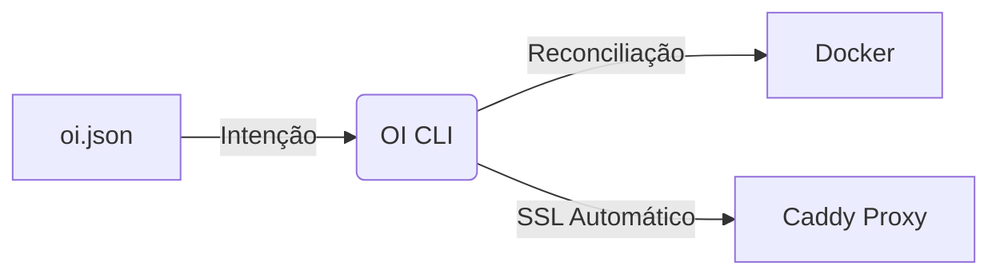

# OI - Orquestrador de Intenção

> **Deployment through Intent, not Configuration.**

OI (Orquestrador de Intenção) é uma ferramenta CLI minimalista (`3MB`) para gerenciar containers com foco em **O QUE** você quer, não **COMO** fazer.

O usuário não escreve Dockerfiles complexos ou arquivos Compose gigantes. Apenas define a **intenção** num arquivo JSON e digita `oi up`.

[](https://github.com/MrJc01/crom-oi/releases)
[](https://github.com/MrJc01/crom-oi/actions)
[](LICENSE)

## 📥 Instalação

Instale a versão mais recente com um único comando:

```bash
curl -sSL https://raw.githubusercontent.com/MrJc01/crom-oi/main/scripts/install.sh | sudo bash
```

O script detecta automaticamente seu sistema (Linux x86_64 ou ARM64) e instala as dependências necessárias.

## ✨ Filosofia



O OI lê um arquivo `oi.json` e **garante que a realidade do servidor** (Docker/Rede/SSL) corresponda exatamente à intenção descrita.

## 🚀 Como Usar

### 1. Inicialize um projeto
```bash
oi init meu-app
```
Isso cria um arquivo `oi.json` otimizado.

### 2. Edite a intenção (Exemplo)
```json
{
  "nome": "meu-app",
  "origem": "docker.io/library/nginx:alpine",
  "dominio": "meu-app.com",
  "porta": 80,
  "recursos": { "cpu": "0.5", "memoria": "128mb" }
}
```

### 3. Deploy (Zero-Downtime)
```bash
sudo oi up
```

Se tudo estiver correto, você verá:
```text
✅ Deploy completo! Acesse: https://meu-app.com
```

> **Nota:** Para desenvolvimento local (`.localhost` ou ip), use `--no-caddy` se não tiver o proxy configurado.

### 4. Gerenciar
```bash
# Ver status de todos os projetos
oi status --all

# Remover tudo (Clean Teardown)
oi down
```

## 🌟 Features Principais

- **🛡️ Hardening Nativo**: Validação fail-fast de DNS e checagem de integridade do Proxy antes de qualquer alteração.
- **🔄 Zero-Downtime Deploy**: Estratégia Blue-Green automática. O novo container só entra se passar no health check.
- **🔙 Rollback Automático**: Se o novo deploy falhar, a versão anterior continua servindo tráfego.
- **🔒 Isolamento de Rede**: Cada projeto vive em sua própria rede Docker isolada (`oi-<projeto>-net`).
- **📦 Sem Banco de Dados**: O estado é armazenado em Docker Labels. Stateless e fácil de recuperar.
- **🌐 SSL Automático**: Integração nativa com Caddy Server para HTTPS automático.

## 🔧 Comandos

| Comando | Descrição |
|---------|-----------|
| `oi up` | Realiza ou atualiza o deploy da intenção atual. |
| `oi down` | Remove containers, redes e rotas do proxy de forma segura. |
| `oi status` | Mostra detalhes do projeto atual. Use `--all` para ver tudo. |
| `oi init` | Cria um novo esqueleto de intenção `oi.json`. |

## 🏗️ Desenvolvimento

Para compilar localmente:

```bash
# Requer Go 1.21+ e Docker
make build

# Instalar localmente
sudo make install

# Rodar validação E2E
sudo ./scripts/validate_e2e.sh
```

## 📦 Requisitos do Sistema

- **OS:** Linux (amd64 / arm64)
- **Runtime:** Docker Engine 20.10+
- **Proxy (Opcional):** Caddy 2.x (para gestão automática de SSL)

---

Licença MIT © 2024
